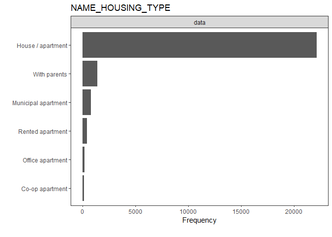

Credit Card Default Prediction
================
by Hasnat Tahir

#### Libraries

``` r
library(dplyr)
library(caTools)
library(DataExplorer)
library(DMwR)
library(rpart)
library(rpart.plot)
library(boot)
library(randomForest)
library(ggplot2)
library(ROCR)
```

#### Importing the “application\_records” dataset

``` r
credit.card = read.csv("application_record.csv") 

dim(credit.card)
```

    ## [1] 438557     18

``` r
colnames(credit.card)
```

    ##  [1] "ID"                  "CODE_GENDER"         "FLAG_OWN_CAR"       
    ##  [4] "FLAG_OWN_REALTY"     "CNT_CHILDREN"        "AMT_INCOME_TOTAL"   
    ##  [7] "NAME_INCOME_TYPE"    "NAME_EDUCATION_TYPE" "NAME_FAMILY_STATUS" 
    ## [10] "NAME_HOUSING_TYPE"   "DAYS_BIRTH"          "DAYS_EMPLOYED"      
    ## [13] "FLAG_MOBIL"          "FLAG_WORK_PHONE"     "FLAG_PHONE"         
    ## [16] "FLAG_EMAIL"          "OCCUPATION_TYPE"     "CNT_FAM_MEMBERS"

Observations:

  - “application\_record” data contains application information which
    can be used for predicting defaulters
  - Data set contains 438,557 observations and 18 variables

**Summary and Structure of the application data**

``` r
str(credit.card)
```

    ## 'data.frame':    438557 obs. of  18 variables:
    ##  $ ID                 : int  5008804 5008805 5008806 5008808 5008809 5008810 5008811 5008812 5008813 5008814 ...
    ##  $ CODE_GENDER        : Factor w/ 2 levels "F","M": 2 2 2 1 1 1 1 1 1 1 ...
    ##  $ FLAG_OWN_CAR       : Factor w/ 2 levels "N","Y": 2 2 2 1 1 1 1 1 1 1 ...
    ##  $ FLAG_OWN_REALTY    : Factor w/ 2 levels "N","Y": 2 2 2 2 2 2 2 2 2 2 ...
    ##  $ CNT_CHILDREN       : int  0 0 0 0 0 0 0 0 0 0 ...
    ##  $ AMT_INCOME_TOTAL   : num  427500 427500 112500 270000 270000 ...
    ##  $ NAME_INCOME_TYPE   : Factor w/ 5 levels "Commercial associate",..: 5 5 5 1 1 1 1 2 2 2 ...
    ##  $ NAME_EDUCATION_TYPE: Factor w/ 5 levels "Academic degree",..: 2 2 5 5 5 5 5 2 2 2 ...
    ##  $ NAME_FAMILY_STATUS : Factor w/ 5 levels "Civil marriage",..: 1 1 2 4 4 4 4 3 3 3 ...
    ##  $ NAME_HOUSING_TYPE  : Factor w/ 6 levels "Co-op apartment",..: 5 5 2 2 2 2 2 2 2 2 ...
    ##  $ DAYS_BIRTH         : int  -12005 -12005 -21474 -19110 -19110 -19110 -19110 -22464 -22464 -22464 ...
    ##  $ DAYS_EMPLOYED      : int  -4542 -4542 -1134 -3051 -3051 -3051 -3051 365243 365243 365243 ...
    ##  $ FLAG_MOBIL         : int  1 1 1 1 1 1 1 1 1 1 ...
    ##  $ FLAG_WORK_PHONE    : int  1 1 0 0 0 0 0 0 0 0 ...
    ##  $ FLAG_PHONE         : int  0 0 0 1 1 1 1 0 0 0 ...
    ##  $ FLAG_EMAIL         : int  0 0 0 1 1 1 1 0 0 0 ...
    ##  $ OCCUPATION_TYPE    : Factor w/ 19 levels "","Accountants",..: 1 1 18 16 16 16 16 1 1 1 ...
    ##  $ CNT_FAM_MEMBERS    : num  2 2 2 1 1 1 1 1 1 1 ...

``` r
summary(credit.card)
```

    ##        ID          CODE_GENDER FLAG_OWN_CAR FLAG_OWN_REALTY  CNT_CHILDREN    
    ##  Min.   :5008804   F:294440    N:275459     N:134483        Min.   : 0.0000  
    ##  1st Qu.:5609375   M:144117    Y:163098     Y:304074        1st Qu.: 0.0000  
    ##  Median :6047745                                            Median : 0.0000  
    ##  Mean   :6022176                                            Mean   : 0.4274  
    ##  3rd Qu.:6456971                                            3rd Qu.: 1.0000  
    ##  Max.   :7999952                                            Max.   :19.0000  
    ##                                                                              
    ##  AMT_INCOME_TOTAL              NAME_INCOME_TYPE 
    ##  Min.   :  26100   Commercial associate:100757  
    ##  1st Qu.: 121500   Pensioner           : 75493  
    ##  Median : 160780   State servant       : 36186  
    ##  Mean   : 187524   Student             :    17  
    ##  3rd Qu.: 225000   Working             :226104  
    ##  Max.   :6750000                                
    ##                                                 
    ##                     NAME_EDUCATION_TYPE            NAME_FAMILY_STATUS
    ##  Academic degree              :   312   Civil marriage      : 36532  
    ##  Higher education             :117522   Married             :299828  
    ##  Incomplete higher            : 14851   Separated           : 27251  
    ##  Lower secondary              :  4051   Single / not married: 55271  
    ##  Secondary / secondary special:301821   Widow               : 19675  
    ##                                                                      
    ##                                                                      
    ##            NAME_HOUSING_TYPE    DAYS_BIRTH     DAYS_EMPLOYED      FLAG_MOBIL
    ##  Co-op apartment    :  1539   Min.   :-25201   Min.   :-17531   Min.   :1   
    ##  House / apartment  :393831   1st Qu.:-19483   1st Qu.: -3103   1st Qu.:1   
    ##  Municipal apartment: 14214   Median :-15630   Median : -1467   Median :1   
    ##  Office apartment   :  3922   Mean   :-15998   Mean   : 60564   Mean   :1   
    ##  Rented apartment   :  5974   3rd Qu.:-12514   3rd Qu.:  -371   3rd Qu.:1   
    ##  With parents       : 19077   Max.   : -7489   Max.   :365243   Max.   :1   
    ##                                                                             
    ##  FLAG_WORK_PHONE    FLAG_PHONE       FLAG_EMAIL        OCCUPATION_TYPE  
    ##  Min.   :0.0000   Min.   :0.0000   Min.   :0.0000              :134203  
    ##  1st Qu.:0.0000   1st Qu.:0.0000   1st Qu.:0.0000   Laborers   : 78240  
    ##  Median :0.0000   Median :0.0000   Median :0.0000   Core staff : 43007  
    ##  Mean   :0.2061   Mean   :0.2878   Mean   :0.1082   Sales staff: 41098  
    ##  3rd Qu.:0.0000   3rd Qu.:1.0000   3rd Qu.:0.0000   Managers   : 35487  
    ##  Max.   :1.0000   Max.   :1.0000   Max.   :1.0000   Drivers    : 26090  
    ##                                                     (Other)    : 80432  
    ##  CNT_FAM_MEMBERS 
    ##  Min.   : 1.000  
    ##  1st Qu.: 2.000  
    ##  Median : 2.000  
    ##  Mean   : 2.194  
    ##  3rd Qu.: 3.000  
    ##  Max.   :20.000  
    ## 

Observations:

  - The data has variables of different data types, including integers,
    factors, and numericals
  - Variables such as FLAG\_MOBIL, FLAG\_WORK\_PHONE, FLAG\_PHONE, and
    FLAG\_EMAIL are binary but are captured as integers here
  - ID variable is customer identifier here
  - DAYS\_BIRTH and DAYS\_EMPLOYED have negative values which signifies
    measurement of days back from the date of observation. For e.g. -1
    will indicate 1 day before the day of observation

#### Importing the “credit\_record” data set

The “credit\_record” data contains users’ behaviour on credit card. The
behaviour is assessed in terms of the credit card balance and the status
of the card in a particular month

``` r
credit.record = read.csv("credit_record.csv")
dim(credit.record)
```

    ## [1] 1048575       3

``` r
names(credit.record)
```

    ## [1] "ID"             "MONTHS_BALANCE" "STATUS"

  - The dataset has 1,048,575 observations and 3 variables

**Summary and Structure of “credit\_record” data set**

``` r
str(credit.record)
```

    ## 'data.frame':    1048575 obs. of  3 variables:
    ##  $ ID            : int  5001711 5001711 5001711 5001711 5001712 5001712 5001712 5001712 5001712 5001712 ...
    ##  $ MONTHS_BALANCE: int  0 -1 -2 -3 0 -1 -2 -3 -4 -5 ...
    ##  $ STATUS        : Factor w/ 8 levels "0","1","2","3",..: 8 1 1 1 7 7 7 7 7 7 ...

``` r
summary(credit.record)
```

    ##        ID          MONTHS_BALANCE       STATUS      
    ##  Min.   :5001711   Min.   :-60.00   C      :442031  
    ##  1st Qu.:5023644   1st Qu.:-29.00   0      :383120  
    ##  Median :5062104   Median :-17.00   X      :209230  
    ##  Mean   :5068286   Mean   :-19.14   1      : 11090  
    ##  3rd Qu.:5113856   3rd Qu.: -7.00   5      :  1693  
    ##  Max.   :5150487   Max.   :  0.00   2      :   868  
    ##                                     (Other):   543

Note:

  - MONTHS\_BALANCE variable: Month of the extracted data is the
    starting point, backwards, 0 is the current month, -1 is the
    previous month, and so on

  - STATUS:
    
      - 0: 1-29 days past due
      - 1: 30-59 days past due
      - 2: 60-89 days overdue
      - 3: 90-119 days overdue
      - 4: 120-149 days overdue
      - 5: Overdue or bad debts, write-offs for more than 150 days
      - C: paid off that month
      - X: No loan for the month

#### Variable type modification for analysis

As per the aforementioned observations variable modifications were done
on the application record dataset

``` r
credit.card$FLAG_MOBIL  = as.factor(credit.card$FLAG_MOBIL)
credit.card$FLAG_WORK_PHONE  = as.factor(credit.card$FLAG_WORK_PHONE)
credit.card$FLAG_PHONE  = as.factor(credit.card$FLAG_PHONE)
credit.card$FLAG_EMAIL  = as.factor(credit.card$FLAG_EMAIL)
credit.card$ID = as.factor(credit.card$ID)

str(credit.card)
```

    ## 'data.frame':    438557 obs. of  18 variables:
    ##  $ ID                 : Factor w/ 438510 levels "5008804","5008805",..: 1 2 3 4 5 6 7 8 9 10 ...
    ##  $ CODE_GENDER        : Factor w/ 2 levels "F","M": 2 2 2 1 1 1 1 1 1 1 ...
    ##  $ FLAG_OWN_CAR       : Factor w/ 2 levels "N","Y": 2 2 2 1 1 1 1 1 1 1 ...
    ##  $ FLAG_OWN_REALTY    : Factor w/ 2 levels "N","Y": 2 2 2 2 2 2 2 2 2 2 ...
    ##  $ CNT_CHILDREN       : int  0 0 0 0 0 0 0 0 0 0 ...
    ##  $ AMT_INCOME_TOTAL   : num  427500 427500 112500 270000 270000 ...
    ##  $ NAME_INCOME_TYPE   : Factor w/ 5 levels "Commercial associate",..: 5 5 5 1 1 1 1 2 2 2 ...
    ##  $ NAME_EDUCATION_TYPE: Factor w/ 5 levels "Academic degree",..: 2 2 5 5 5 5 5 2 2 2 ...
    ##  $ NAME_FAMILY_STATUS : Factor w/ 5 levels "Civil marriage",..: 1 1 2 4 4 4 4 3 3 3 ...
    ##  $ NAME_HOUSING_TYPE  : Factor w/ 6 levels "Co-op apartment",..: 5 5 2 2 2 2 2 2 2 2 ...
    ##  $ DAYS_BIRTH         : int  -12005 -12005 -21474 -19110 -19110 -19110 -19110 -22464 -22464 -22464 ...
    ##  $ DAYS_EMPLOYED      : int  -4542 -4542 -1134 -3051 -3051 -3051 -3051 365243 365243 365243 ...
    ##  $ FLAG_MOBIL         : Factor w/ 1 level "1": 1 1 1 1 1 1 1 1 1 1 ...
    ##  $ FLAG_WORK_PHONE    : Factor w/ 2 levels "0","1": 2 2 1 1 1 1 1 1 1 1 ...
    ##  $ FLAG_PHONE         : Factor w/ 2 levels "0","1": 1 1 1 2 2 2 2 1 1 1 ...
    ##  $ FLAG_EMAIL         : Factor w/ 2 levels "0","1": 1 1 1 2 2 2 2 1 1 1 ...
    ##  $ OCCUPATION_TYPE    : Factor w/ 19 levels "","Accountants",..: 1 1 18 16 16 16 16 1 1 1 ...
    ##  $ CNT_FAM_MEMBERS    : num  2 2 2 1 1 1 1 1 1 1 ...

``` r
summary(credit.card)
```

    ##        ID         CODE_GENDER FLAG_OWN_CAR FLAG_OWN_REALTY  CNT_CHILDREN    
    ##  7022197:     2   F:294440    N:275459     N:134483        Min.   : 0.0000  
    ##  7022327:     2   M:144117    Y:163098     Y:304074        1st Qu.: 0.0000  
    ##  7023108:     2                                            Median : 0.0000  
    ##  7023651:     2                                            Mean   : 0.4274  
    ##  7024111:     2                                            3rd Qu.: 1.0000  
    ##  7036518:     2                                            Max.   :19.0000  
    ##  (Other):438545                                                             
    ##  AMT_INCOME_TOTAL              NAME_INCOME_TYPE 
    ##  Min.   :  26100   Commercial associate:100757  
    ##  1st Qu.: 121500   Pensioner           : 75493  
    ##  Median : 160780   State servant       : 36186  
    ##  Mean   : 187524   Student             :    17  
    ##  3rd Qu.: 225000   Working             :226104  
    ##  Max.   :6750000                                
    ##                                                 
    ##                     NAME_EDUCATION_TYPE            NAME_FAMILY_STATUS
    ##  Academic degree              :   312   Civil marriage      : 36532  
    ##  Higher education             :117522   Married             :299828  
    ##  Incomplete higher            : 14851   Separated           : 27251  
    ##  Lower secondary              :  4051   Single / not married: 55271  
    ##  Secondary / secondary special:301821   Widow               : 19675  
    ##                                                                      
    ##                                                                      
    ##            NAME_HOUSING_TYPE    DAYS_BIRTH     DAYS_EMPLOYED    FLAG_MOBIL
    ##  Co-op apartment    :  1539   Min.   :-25201   Min.   :-17531   1:438557  
    ##  House / apartment  :393831   1st Qu.:-19483   1st Qu.: -3103             
    ##  Municipal apartment: 14214   Median :-15630   Median : -1467             
    ##  Office apartment   :  3922   Mean   :-15998   Mean   : 60564             
    ##  Rented apartment   :  5974   3rd Qu.:-12514   3rd Qu.:  -371             
    ##  With parents       : 19077   Max.   : -7489   Max.   :365243             
    ##                                                                           
    ##  FLAG_WORK_PHONE FLAG_PHONE FLAG_EMAIL    OCCUPATION_TYPE   CNT_FAM_MEMBERS 
    ##  0:348156        0:312353   0:391102              :134203   Min.   : 1.000  
    ##  1: 90401        1:126204   1: 47455   Laborers   : 78240   1st Qu.: 2.000  
    ##                                        Core staff : 43007   Median : 2.000  
    ##                                        Sales staff: 41098   Mean   : 2.194  
    ##                                        Managers   : 35487   3rd Qu.: 3.000  
    ##                                        Drivers    : 26090   Max.   :20.000  
    ##                                        (Other)    : 80432

Observations:

  - DAYS\_EMPLOYED contains some positive values as well
  - CNT\_CHILDREN and CNT\_FAM\_MEMBERS variables have a very high
    maximum
  - OCCUPATION\_TYPE variable has about 30% missing data

#### Abnormality Check

As per the above observations abnormalities in the data was studied

``` r
# Why there are +ve values in Days_employed?!
dim(credit.card[credit.card$DAYS_EMPLOYED >0,])[1]  # 75,329 positive values
```

    ## [1] 75329

``` r
table(credit.card[credit.card$DAYS_EMPLOYED >0,]$NAME_INCOME_TYPE)
```

    ## 
    ## Commercial associate            Pensioner        State servant 
    ##                    0                75329                    0 
    ##              Student              Working 
    ##                    0                    0

All positive values corresponds to pensioners. Why?

  - All pensioners have days employed as 365243 (which is a default
    value); 75k such observations are there. After merging both the
    datasets if these values are still present some action will be taken

Conversion of “DAYS\_BIRTH” and “DAYS\_EMPLOYED” variables into years

``` r
credit.card$age= -1*(credit.card$DAYS_BIRTH/365) #check how to consider leap years as well

credit.card$years_employed= -1*(credit.card$DAYS_EMPLOYED/365) #check how to consider leap years as well

summary(credit.card$age)
```

    ##    Min. 1st Qu.  Median    Mean 3rd Qu.    Max. 
    ##   20.52   34.28   42.82   43.83   53.38   69.04

``` r
summary(credit.card$years_employed)
```

    ##      Min.   1st Qu.    Median      Mean   3rd Qu.      Max. 
    ## -1000.666     1.016     4.019  -165.928     8.501    48.030

``` r
summary(credit.card$DAYS_EMPLOYED) 
```

    ##    Min. 1st Qu.  Median    Mean 3rd Qu.    Max. 
    ##  -17531   -3103   -1467   60564    -371  365243

``` r
#dropping "DAYS_BIRTH" and "DAYS_EMPLOYED"
names(credit.card)
```

    ##  [1] "ID"                  "CODE_GENDER"         "FLAG_OWN_CAR"       
    ##  [4] "FLAG_OWN_REALTY"     "CNT_CHILDREN"        "AMT_INCOME_TOTAL"   
    ##  [7] "NAME_INCOME_TYPE"    "NAME_EDUCATION_TYPE" "NAME_FAMILY_STATUS" 
    ## [10] "NAME_HOUSING_TYPE"   "DAYS_BIRTH"          "DAYS_EMPLOYED"      
    ## [13] "FLAG_MOBIL"          "FLAG_WORK_PHONE"     "FLAG_PHONE"         
    ## [16] "FLAG_EMAIL"          "OCCUPATION_TYPE"     "CNT_FAM_MEMBERS"    
    ## [19] "age"                 "years_employed"

``` r
credit.card = credit.card[, -c(11,12)]
summary(credit.card)
```

    ##        ID         CODE_GENDER FLAG_OWN_CAR FLAG_OWN_REALTY  CNT_CHILDREN    
    ##  7022197:     2   F:294440    N:275459     N:134483        Min.   : 0.0000  
    ##  7022327:     2   M:144117    Y:163098     Y:304074        1st Qu.: 0.0000  
    ##  7023108:     2                                            Median : 0.0000  
    ##  7023651:     2                                            Mean   : 0.4274  
    ##  7024111:     2                                            3rd Qu.: 1.0000  
    ##  7036518:     2                                            Max.   :19.0000  
    ##  (Other):438545                                                             
    ##  AMT_INCOME_TOTAL              NAME_INCOME_TYPE 
    ##  Min.   :  26100   Commercial associate:100757  
    ##  1st Qu.: 121500   Pensioner           : 75493  
    ##  Median : 160780   State servant       : 36186  
    ##  Mean   : 187524   Student             :    17  
    ##  3rd Qu.: 225000   Working             :226104  
    ##  Max.   :6750000                                
    ##                                                 
    ##                     NAME_EDUCATION_TYPE            NAME_FAMILY_STATUS
    ##  Academic degree              :   312   Civil marriage      : 36532  
    ##  Higher education             :117522   Married             :299828  
    ##  Incomplete higher            : 14851   Separated           : 27251  
    ##  Lower secondary              :  4051   Single / not married: 55271  
    ##  Secondary / secondary special:301821   Widow               : 19675  
    ##                                                                      
    ##                                                                      
    ##            NAME_HOUSING_TYPE  FLAG_MOBIL FLAG_WORK_PHONE FLAG_PHONE FLAG_EMAIL
    ##  Co-op apartment    :  1539   1:438557   0:348156        0:312353   0:391102  
    ##  House / apartment  :393831              1: 90401        1:126204   1: 47455  
    ##  Municipal apartment: 14214                                                   
    ##  Office apartment   :  3922                                                   
    ##  Rented apartment   :  5974                                                   
    ##  With parents       : 19077                                                   
    ##                                                                               
    ##     OCCUPATION_TYPE   CNT_FAM_MEMBERS       age        years_employed     
    ##             :134203   Min.   : 1.000   Min.   :20.52   Min.   :-1000.666  
    ##  Laborers   : 78240   1st Qu.: 2.000   1st Qu.:34.28   1st Qu.:    1.016  
    ##  Core staff : 43007   Median : 2.000   Median :42.82   Median :    4.019  
    ##  Sales staff: 41098   Mean   : 2.194   Mean   :43.83   Mean   : -165.928  
    ##  Managers   : 35487   3rd Qu.: 3.000   3rd Qu.:53.38   3rd Qu.:    8.501  
    ##  Drivers    : 26090   Max.   :20.000   Max.   :69.04   Max.   :   48.030  
    ##  (Other)    : 80432

``` r
#Check for minimum employed years
min(credit.card[credit.card$years_employed > -1000, ]$years_employed)
```

    ## [1] 0.03287671

New variables age and years\_employed were created.

#### Checking for Duplicates

``` r
check = as.data.frame(table(credit.card$ID))
dim(check)
```

    ## [1] 438510      2

``` r
dim(check[check$Freq>=2,])[1]
```

    ## [1] 47

``` r
dim(credit.card[credit.card$ID == 7036518,])[1] #multiple values for the same client ##abnormal 
```

    ## [1] 2

``` r
dim(credit.card)[1]-length(unique(credit.card$ID)) #not unique values
```

    ## [1] 47

  - Multiple records were observed under the same customer ID for 47
    IDs.
  - Such IDs can be treated as distinct because only the ID is same but
    the rest of the data is unique that can be used for modelling.
    Hence, these values were not dropped.

#### Outlier Analysis

``` r
par(mfrow=c(2,3))
boxplot(credit.card$AMT_INCOME_TOTAL, main= "AMT_INCOME_TOTAL", col="lightblue")
boxplot(credit.card$CNT_CHILDREN, main="CNT_CHILDREN", col= "lightgreen")
boxplot(credit.card$CNT_FAM_MEMBERS, main= "CNT_FAM_MEMBERS", col="orange")
boxplot(credit.card$age, main= "Age", col="cyan")
boxplot(credit.card$years_employed, main= "years_employed", col="purple")
```

<!-- -->

  - Outliers can be observed in AMT\_INCOME\_TOTAL, CNT\_CHILDREN,
    CNT\_FAM\_MEMBERS, and years\_employed

**Outlier Count**

``` r
length(boxplot(credit.card$CNT_CHILDREN, plot = F)$out)#about 6k , check targets in these 
```

    ## [1] 6075

``` r
length(boxplot(credit.card$AMT_INCOME_TOTAL, plot =F)$out)#check different percentiles after merging
```

    ## [1] 19108

``` r
length(boxplot(credit.card$CNT_FAM_MEMBERS, plot = F)$out)#about 5k , check overlap with cnt_children
```

    ## [1] 5690

``` r
length(boxplot(credit.card$years_employed, plot =F)$out)
```

    ## [1] 97300

Observed outliers will be taken care of after merging

#### Variable type modification in “credit record” data set

``` r
credit.record$ID = as.character(credit.record$ID)
credit.record$MONTHS_BALANCE = as.factor(credit.record$MONTHS_BALANCE)

summary(credit.record)
```

    ##       ID            MONTHS_BALANCE       STATUS      
    ##  Length:1048575     -1     : 34436   C      :442031  
    ##  Class :character   -2     : 34209   0      :383120  
    ##  Mode  :character   0      : 33856   X      :209230  
    ##                     -3     : 33854   1      : 11090  
    ##                     -4     : 33365   5      :  1693  
    ##                     -5     : 32881   2      :   868  
    ##                     (Other):845974   (Other):   543

``` r
table((credit.record$STATUS))
```

    ## 
    ##      0      1      2      3      4      5      C      X 
    ## 383120  11090    868    320    223   1693 442031 209230

#### Understanding the “credit\_record” data set

``` r
head(as.data.frame(table(credit.record$ID)),10)
```

    ##       Var1 Freq
    ## 1  5001711    4
    ## 2  5001712   19
    ## 3  5001713   22
    ## 4  5001714   15
    ## 5  5001715   60
    ## 6  5001717   22
    ## 7  5001718   39
    ## 8  5001719   43
    ## 9  5001720   36
    ## 10 5001723   31

``` r
head(credit.record[credit.record$ID == 5001718, ],10)
```

    ##          ID MONTHS_BALANCE STATUS
    ## 143 5001718              0      C
    ## 144 5001718             -1      C
    ## 145 5001718             -2      C
    ## 146 5001718             -3      0
    ## 147 5001718             -4      0
    ## 148 5001718             -5      0
    ## 149 5001718             -6      0
    ## 150 5001718             -7      0
    ## 151 5001718             -8      1
    ## 152 5001718             -9      X

Multiple entries of ID are there as there is data for multiple months
for a particular ID

#### Default(Bad score) categorization

As per banking industry standards of a risky customer (i.e. based on
long overdues) and definition of Status variable, a record is marked as
default if “Status” is 3,4, or 5 and delinquent if 1 or 2. Deliquency
has been considered here as in some cases a customer becomes delinquent
but recovers rather than being a defaulter.

``` r
credit.record = as.data.frame(credit.record)
bad.score = subset(credit.record, credit.record$STATUS %in% c(3,4,5))
dim(bad.score)
```

    ## [1] 2236    3

``` r
length(unique(bad.score$ID))
```

    ## [1] 331

``` r
length(unique(credit.record$ID))
```

    ## [1] 45985

331 deafault observations out of a total population of 45985
accounts/customers

#### Variables for Default and Delinquent

``` r
credit.record['default'] = ifelse(credit.record$STATUS %in% c(3,4,5),1,0)
credit.record['delinq'] = ifelse(credit.record$STATUS == 2 ,1,0)
#did this to get a unique value for each client
agg_creditdata = credit.record %>% group_by(ID) %>% summarize(default=sum(default),delinq=sum(delinq))

dim(agg_creditdata)
```

    ## [1] 45985     3

``` r
head(agg_creditdata)
```

    ## # A tibble: 6 x 3
    ##   ID      default delinq
    ##   <chr>     <dbl>  <dbl>
    ## 1 5001711       0      0
    ## 2 5001712       0      0
    ## 3 5001713       0      0
    ## 4 5001714       0      0
    ## 5 5001715       0      0
    ## 6 5001717       0      0

Since, a customer has records for different months, default flag is
created by aggregating the data on customer level. If a customer was in
default status atleast once it is marked as default

``` r
agg_creditdata['default'] = ifelse(agg_creditdata$default != 0,1,0)
agg_creditdata['delinq'] = ifelse(agg_creditdata$delinq != 0 ,1,0)

agg_creditdata$default = factor(agg_creditdata$default)
agg_creditdata$delinq = factor(agg_creditdata$delinq)

summary(agg_creditdata)
```

    ##       ID            default   delinq   
    ##  Length:45985       0:45654   0:45388  
    ##  Class :character   1:  331   1:  597  
    ##  Mode  :character

Observations:

  - Number of Default observation = 331 that is 0.7% of the total data
  - Number of Delinquent observation = 597 that is 1.3% of the total
    data

#### Master Data (merging both the data sets by ID)

Both the data sets were merged on ID variable

``` r
final.data = merge(x= credit.card, y= agg_creditdata, by.x = "ID", by.y = "ID")

dim(final.data)
```

    ## [1] 36457    20

``` r
summary(final.data)
```

    ##        ID        CODE_GENDER FLAG_OWN_CAR FLAG_OWN_REALTY  CNT_CHILDREN    
    ##  5008804:    1   F:24430     N:22614      N:11951         Min.   : 0.0000  
    ##  5008805:    1   M:12027     Y:13843      Y:24506         1st Qu.: 0.0000  
    ##  5008806:    1                                            Median : 0.0000  
    ##  5008808:    1                                            Mean   : 0.4303  
    ##  5008809:    1                                            3rd Qu.: 1.0000  
    ##  5008810:    1                                            Max.   :19.0000  
    ##  (Other):36451                                                             
    ##  AMT_INCOME_TOTAL              NAME_INCOME_TYPE
    ##  Min.   :  27000   Commercial associate: 8490  
    ##  1st Qu.: 121500   Pensioner           : 6152  
    ##  Median : 157500   State servant       : 2985  
    ##  Mean   : 186686   Student             :   11  
    ##  3rd Qu.: 225000   Working             :18819  
    ##  Max.   :1575000                               
    ##                                                
    ##                     NAME_EDUCATION_TYPE            NAME_FAMILY_STATUS
    ##  Academic degree              :   32    Civil marriage      : 2945   
    ##  Higher education             : 9864    Married             :25048   
    ##  Incomplete higher            : 1410    Separated           : 2103   
    ##  Lower secondary              :  374    Single / not married: 4829   
    ##  Secondary / secondary special:24777    Widow               : 1532   
    ##                                                                      
    ##                                                                      
    ##            NAME_HOUSING_TYPE FLAG_MOBIL FLAG_WORK_PHONE FLAG_PHONE FLAG_EMAIL
    ##  Co-op apartment    :  168   1:36457    0:28235         0:25709    0:33186   
    ##  House / apartment  :32548              1: 8222         1:10748    1: 3271   
    ##  Municipal apartment: 1128                                                   
    ##  Office apartment   :  262                                                   
    ##  Rented apartment   :  575                                                   
    ##  With parents       : 1776                                                   
    ##                                                                              
    ##     OCCUPATION_TYPE  CNT_FAM_MEMBERS       age        years_employed     
    ##             :11323   Min.   : 1.000   Min.   :20.52   Min.   :-1000.666  
    ##  Laborers   : 6211   1st Qu.: 2.000   1st Qu.:34.14   1st Qu.:    1.118  
    ##  Core staff : 3591   Median : 2.000   Median :42.64   Median :    4.252  
    ##  Sales staff: 3485   Mean   : 2.198   Mean   :43.77   Mean   : -162.364  
    ##  Managers   : 3012   3rd Qu.: 3.000   3rd Qu.:53.25   3rd Qu.:    8.638  
    ##  Drivers    : 2138   Max.   :20.000   Max.   :68.91   Max.   :   43.049  
    ##  (Other)    : 6697                                                       
    ##  default   delinq   
    ##  0:36155   0:35902  
    ##  1:  302   1:  555  
    ##                     
    ##                     
    ##                     
    ##                     
    ## 

Observations:

  - 36,457 observations are left
  - Default and Delinquent are 0.8% and 1.5% respectively of the total
    data at hand
  - Data is imbalanced as we have less number of default observations
  - OCCUPATION\_TYPE still has 31% missing values
  - FLAG\_MOBIL has only one value (i.e. 1), hence, it will be removed

Occupation is an important parameter to assess risk of default for a
customer. Hence, despite of OCCUPATION\_TYPE having too many NA values
it will be retained and the NA observations will be removed as
imputation is not an option here.

``` r
#assign NA's in occupation type
final.data = final.data %>% mutate_all(na_if,"")

#removed flag_mobil as it has single obs and ID too (reg mod not running because of it) and the missing values
final.data1 = subset(final.data, is.na(final.data$OCCUPATION_TYPE) == F, select = -c(1,11))

summary(final.data1[ ,c(17,18)]) #count
```

    ##  default   delinq   
    ##  0:24931   0:24753  
    ##  1:  203   1:  381

Observations:

  - Now, 25,134 observation left
  - Default and Delinquent are 0.8% and 1.5% respectively of the total
    data at hand

#### Exploratory Data Analysis

``` r
par(mfrow = c(2,3))
hist(final.data1$CNT_CHILDREN, col = "cyan", main = "CNT_CHILDREN")
hist(final.data1$CNT_FAM_MEMBERS, col = "cyan", main = "CNT_FAM_MEMBERS")
hist(final.data1$AMT_INCOME_TOTAL, col = "cyan", main = "AMT_INCOME_TOTAL")
hist(final.data1$age, col = "cyan", main = "Age")
hist(final.data1$years_employed, col = "cyan", main = "years_employed")
```

<!-- -->

``` r
par(mfrow = c(2,4))
barplot(table(final.data1$CODE_GENDER), col = "cyan", main = "CODE_GENDER")
barplot(table(final.data1$FLAG_OWN_CAR), col = "cyan", main = "FLAG_OWN_CAR")
barplot(table(final.data1$FLAG_OWN_REALTY), col = "cyan", main = "FLAG_OWN_REALTY")
barplot(table(final.data1$FLAG_WORK_PHONE), col = "cyan", main = "FLAG_WORK_PHONE")
barplot(table(final.data1$FLAG_PHONE), col = "cyan", main = "FLAG_PHONE")
barplot(table(final.data1$FLAG_EMAIL), col = "cyan", main = "FLAG_EMAIL")
barplot(table(final.data1$default), col = "cyan", main = "default")
barplot(table(final.data1$delinq), col = "cyan", main = "delinq")
```

<!-- -->

``` r
plot_bar(final.data1$OCCUPATION_TYPE, ggtheme = theme_test(), title = "OCCUPATION_TYPE")
```

<!-- -->

``` r
plot_bar(final.data1$NAME_INCOME_TYPE, ggtheme = theme_test(), title = "NAME_INCOME_TYPE")
```

<!-- -->

``` r
plot_bar(final.data1$NAME_EDUCATION_TYPE, ggtheme = theme_test(), title = "NAME_EDUCATION_TYPE")
```

<!-- -->

``` r
plot_bar(final.data1$NAME_FAMILY_STATUS, ggtheme = theme_test(), title = "NAME_FAMILY_STATUS")
```

<!-- -->

``` r
plot_bar(final.data1$NAME_HOUSING_TYPE, ggtheme = theme_test(), title = "NAME_HOUSING_TYPE")
```

<!-- -->

Observations:

  - final dataset has more observations corresponding to:
      - Female
      - No Car
      - Own a real state property
      - No work phone
      - No phone
      - No email
      - Ocupation - Laborers
      - Income type - Working
      - Education type - Secondary
      - Family status - Married
      - Housing type - House/apartment

#### Outlier Analysis - II

``` r
length(boxplot(final.data1$CNT_CHILDREN, plot = F)$out) # about 6k , check targets in these 
```

    ## [1] 393

``` r
length(boxplot(final.data1$AMT_INCOME_TOTAL, plot = F)$out) # check different percentiles after merging
```

    ## [1] 1180

``` r
length(boxplot(final.data1$CNT_FAM_MEMBERS, plot = F)$out) # about 5k , check overlap with cnt_children
```

    ## [1] 382

``` r
length(boxplot(final.data1$years_employed, plot = F)$out) # outliers observed
```

    ## [1] 1486

``` r
table(boxplot(final.data1$CNT_CHILDREN, plot = F)$out) #some outliers observed 7,14,19
```

    ## 
    ##   3   4   5   7  14  19 
    ## 312  57  18   2   3   1

``` r
out_inc = boxplot(final.data1$AMT_INCOME_TOTAL, plot = F)$out

out_cnt = boxplot(final.data1$CNT_CHILDREN, plot = F)$out

out_fam = boxplot(final.data1$CNT_FAM_MEMBERS, plot = F)$out

out_yemp = boxplot(final.data1$years_employed, plot = F)$out

table(final.data1[which(final.data1$CNT_CHILDREN %in% out_cnt 
                        | final.data1$AMT_INCOME_TOTAL %in% out_inc
                        | final.data1$CNT_FAM_MEMBERS %in% out_fam),]$default)
```

    ## 
    ##    0    1 
    ## 1520   23

  - Cnt\_children contains 5 default values out of 393
  - amt\_income\_total contains 18 default values out of 11k
  - Not removing outliers as the values doesn’t seem to be unrealistic
    or wrong as per intuition

<a href="#top">Back to top</a>

## Model Building

(70-30) Train-Test Sampling

``` r
#sampling
set.seed(2205)
split = sample.split(final.data1$default, SplitRatio = 0.70)

card.train = subset(final.data1, split == TRUE)
card.test = subset(final.data1, split == FALSE)

#unique values
table(card.train$default)
```

    ## 
    ##     0     1 
    ## 17452   142

``` r
table(card.test$default)
```

    ## 
    ##    0    1 
    ## 7479   61

Observations:

  - In the training sample there are very few defaulters to build model
    on, SMOTE will be used to treat this imbalance

#### SMOTE

``` r
#study perc.over and under and limitations of smote like upto what extent we can create data
#created ~9% default values
card.train1 = SMOTE(default~., card.train, perc.over = 900, perc.under = 1150)

table(card.train$default)
```

    ## 
    ##     0     1 
    ## 17452   142

``` r
table(card.train1$default)
```

    ## 
    ##     0     1 
    ## 14697  1420

**SMOTE resulted in increased default percentage in train data from 0.8%
to 8.8%**

#### Full Logistic regression model

``` r
#model with all variables
log_mod = glm(default~., family = "binomial", card.train1)
summary(log_mod)
```

    ## 
    ## Call:
    ## glm(formula = default ~ ., family = "binomial", data = card.train1)
    ## 
    ## Deviance Residuals: 
    ##     Min       1Q   Median       3Q      Max  
    ## -3.1005  -0.2054  -0.1439  -0.1025   3.4176  
    ## 
    ## Coefficients:
    ##                                                    Estimate Std. Error z value
    ## (Intercept)                                      -1.771e+01  1.615e+03  -0.011
    ## CODE_GENDERM                                      5.477e-01  1.227e-01   4.463
    ## FLAG_OWN_CARY                                    -8.130e-02  1.098e-01  -0.740
    ## FLAG_OWN_REALTYY                                 -1.551e-01  1.068e-01  -1.452
    ## CNT_CHILDREN                                     -6.411e-01  2.042e-01  -3.139
    ## AMT_INCOME_TOTAL                                 -2.043e-06  6.662e-07  -3.066
    ## NAME_INCOME_TYPEPensioner                         1.951e+00  8.022e-01   2.432
    ## NAME_INCOME_TYPEState servant                    -1.142e+00  2.124e-01  -5.376
    ## NAME_INCOME_TYPEStudent                          -1.464e+01  3.956e+03  -0.004
    ## NAME_INCOME_TYPEWorking                          -6.012e-01  1.105e-01  -5.442
    ## NAME_EDUCATION_TYPEHigher education               1.265e+01  1.615e+03   0.008
    ## NAME_EDUCATION_TYPEIncomplete higher              1.270e+01  1.615e+03   0.008
    ## NAME_EDUCATION_TYPELower secondary                1.455e+01  1.615e+03   0.009
    ## NAME_EDUCATION_TYPESecondary / secondary special  1.238e+01  1.615e+03   0.008
    ## NAME_FAMILY_STATUSMarried                         4.742e-01  2.018e-01   2.350
    ## NAME_FAMILY_STATUSSeparated                       1.242e+00  3.465e-01   3.584
    ## NAME_FAMILY_STATUSSingle / not married            1.814e+00  2.716e-01   6.678
    ## NAME_FAMILY_STATUSWidow                           1.858e+00  3.971e-01   4.679
    ## NAME_HOUSING_TYPEHouse / apartment               -1.847e+00  3.689e-01  -5.007
    ## NAME_HOUSING_TYPEMunicipal apartment             -3.500e-01  4.041e-01  -0.866
    ## NAME_HOUSING_TYPEOffice apartment                -3.019e-01  5.035e-01  -0.600
    ## NAME_HOUSING_TYPERented apartment                -2.192e+00  5.642e-01  -3.885
    ## NAME_HOUSING_TYPEWith parents                    -2.692e+00  4.535e-01  -5.935
    ## FLAG_WORK_PHONE1                                  2.741e-01  1.130e-01   2.426
    ## FLAG_PHONE1                                       6.646e-01  1.090e-01   6.096
    ## FLAG_EMAIL1                                       5.610e-01  1.464e-01   3.832
    ## OCCUPATION_TYPECleaning staff                     3.002e-01  4.846e-01   0.619
    ## OCCUPATION_TYPECooking staff                      1.002e+00  4.268e-01   2.347
    ## OCCUPATION_TYPECore staff                         1.381e+00  2.862e-01   4.826
    ## OCCUPATION_TYPEDrivers                            1.226e+00  3.127e-01   3.920
    ## OCCUPATION_TYPEHigh skill tech staff              5.427e-01  3.459e-01   1.569
    ## OCCUPATION_TYPEHR staff                          -1.279e+01  5.823e+02  -0.022
    ## OCCUPATION_TYPEIT staff                          -1.963e-01  8.000e-01  -0.245
    ## OCCUPATION_TYPELaborers                           4.434e-01  2.898e-01   1.530
    ## OCCUPATION_TYPELow-skill Laborers                -1.855e+00  6.185e-01  -3.000
    ## OCCUPATION_TYPEManagers                           2.954e-01  3.124e-01   0.946
    ## OCCUPATION_TYPEMedicine staff                     1.078e+00  3.661e-01   2.944
    ## OCCUPATION_TYPEPrivate service staff             -1.275e+01  2.671e+02  -0.048
    ## OCCUPATION_TYPERealty agents                     -1.245e+01  5.931e+02  -0.021
    ## OCCUPATION_TYPESales staff                        3.368e-01  3.021e-01   1.115
    ## OCCUPATION_TYPESecretaries                        3.287e+00  3.783e-01   8.690
    ## OCCUPATION_TYPESecurity staff                     1.073e+00  3.835e-01   2.797
    ## OCCUPATION_TYPEWaiters/barmen staff               1.108e+00  6.283e-01   1.764
    ## CNT_FAM_MEMBERS                                   6.664e-01  1.873e-01   3.559
    ## age                                               2.077e-02  6.271e-03   3.313
    ## years_employed                                   -3.143e-02  1.038e-02  -3.027
    ## delinq1                                           6.042e+00  1.282e-01  47.138
    ##                                                  Pr(>|z|)    
    ## (Intercept)                                      0.991252    
    ## CODE_GENDERM                                     8.08e-06 ***
    ## FLAG_OWN_CARY                                    0.459071    
    ## FLAG_OWN_REALTYY                                 0.146371    
    ## CNT_CHILDREN                                     0.001694 ** 
    ## AMT_INCOME_TOTAL                                 0.002166 ** 
    ## NAME_INCOME_TYPEPensioner                        0.015024 *  
    ## NAME_INCOME_TYPEState servant                    7.62e-08 ***
    ## NAME_INCOME_TYPEStudent                          0.997047    
    ## NAME_INCOME_TYPEWorking                          5.27e-08 ***
    ## NAME_EDUCATION_TYPEHigher education              0.993749    
    ## NAME_EDUCATION_TYPEIncomplete higher             0.993726    
    ## NAME_EDUCATION_TYPELower secondary               0.992812    
    ## NAME_EDUCATION_TYPESecondary / secondary special 0.993883    
    ## NAME_FAMILY_STATUSMarried                        0.018763 *  
    ## NAME_FAMILY_STATUSSeparated                      0.000338 ***
    ## NAME_FAMILY_STATUSSingle / not married           2.43e-11 ***
    ## NAME_FAMILY_STATUSWidow                          2.88e-06 ***
    ## NAME_HOUSING_TYPEHouse / apartment               5.53e-07 ***
    ## NAME_HOUSING_TYPEMunicipal apartment             0.386379    
    ## NAME_HOUSING_TYPEOffice apartment                0.548707    
    ## NAME_HOUSING_TYPERented apartment                0.000103 ***
    ## NAME_HOUSING_TYPEWith parents                    2.94e-09 ***
    ## FLAG_WORK_PHONE1                                 0.015259 *  
    ## FLAG_PHONE1                                      1.09e-09 ***
    ## FLAG_EMAIL1                                      0.000127 ***
    ## OCCUPATION_TYPECleaning staff                    0.535664    
    ## OCCUPATION_TYPECooking staff                     0.018928 *  
    ## OCCUPATION_TYPECore staff                        1.39e-06 ***
    ## OCCUPATION_TYPEDrivers                           8.85e-05 ***
    ## OCCUPATION_TYPEHigh skill tech staff             0.116630    
    ## OCCUPATION_TYPEHR staff                          0.982482    
    ## OCCUPATION_TYPEIT staff                          0.806168    
    ## OCCUPATION_TYPELaborers                          0.125953    
    ## OCCUPATION_TYPELow-skill Laborers                0.002703 ** 
    ## OCCUPATION_TYPEManagers                          0.344364    
    ## OCCUPATION_TYPEMedicine staff                    0.003241 ** 
    ## OCCUPATION_TYPEPrivate service staff             0.961923    
    ## OCCUPATION_TYPERealty agents                     0.983259    
    ## OCCUPATION_TYPESales staff                       0.264906    
    ## OCCUPATION_TYPESecretaries                        < 2e-16 ***
    ## OCCUPATION_TYPESecurity staff                    0.005166 ** 
    ## OCCUPATION_TYPEWaiters/barmen staff              0.077707 .  
    ## CNT_FAM_MEMBERS                                  0.000373 ***
    ## age                                              0.000925 ***
    ## years_employed                                   0.002467 ** 
    ## delinq1                                           < 2e-16 ***
    ## ---
    ## Signif. codes:  0 '***' 0.001 '**' 0.01 '*' 0.05 '.' 0.1 ' ' 1
    ## 
    ## (Dispersion parameter for binomial family taken to be 1)
    ## 
    ##     Null deviance: 9610.0  on 16116  degrees of freedom
    ## Residual deviance: 3350.5  on 16070  degrees of freedom
    ## AIC: 3444.5
    ## 
    ## Number of Fisher Scoring iterations: 16

#### Variable Selection

Variable selection was performed using stepwise method on the basis of
AIC and BIC both

``` r
#Stepwise 
card_step = step(log_mod, direction = "both") #AIC
```

    ## Start:  AIC=3444.49
    ## default ~ CODE_GENDER + FLAG_OWN_CAR + FLAG_OWN_REALTY + CNT_CHILDREN + 
    ##     AMT_INCOME_TOTAL + NAME_INCOME_TYPE + NAME_EDUCATION_TYPE + 
    ##     NAME_FAMILY_STATUS + NAME_HOUSING_TYPE + FLAG_WORK_PHONE + 
    ##     FLAG_PHONE + FLAG_EMAIL + OCCUPATION_TYPE + CNT_FAM_MEMBERS + 
    ##     age + years_employed + delinq
    ## 
    ##                       Df Deviance    AIC
    ## - FLAG_OWN_CAR         1   3351.0 3443.0
    ## <none>                     3350.5 3444.5
    ## - FLAG_OWN_REALTY      1   3352.6 3444.6
    ## - FLAG_WORK_PHONE      1   3356.3 3448.3
    ## - CNT_CHILDREN         1   3360.0 3452.0
    ## - years_employed       1   3360.2 3452.2
    ## - AMT_INCOME_TOTAL     1   3360.8 3452.8
    ## - age                  1   3361.4 3453.4
    ## - CNT_FAM_MEMBERS      1   3362.5 3454.5
    ## - FLAG_EMAIL           1   3364.5 3456.5
    ## - CODE_GENDER          1   3370.5 3462.5
    ## - FLAG_PHONE           1   3387.6 3479.6
    ## - NAME_EDUCATION_TYPE  4   3396.5 3482.5
    ## - NAME_INCOME_TYPE     4   3406.8 3492.8
    ## - NAME_FAMILY_STATUS   4   3407.6 3493.6
    ## - NAME_HOUSING_TYPE    5   3449.7 3533.7
    ## - OCCUPATION_TYPE     17   3513.3 3573.3
    ## - delinq               1   7880.0 7972.0
    ## 
    ## Step:  AIC=3443.04
    ## default ~ CODE_GENDER + FLAG_OWN_REALTY + CNT_CHILDREN + AMT_INCOME_TOTAL + 
    ##     NAME_INCOME_TYPE + NAME_EDUCATION_TYPE + NAME_FAMILY_STATUS + 
    ##     NAME_HOUSING_TYPE + FLAG_WORK_PHONE + FLAG_PHONE + FLAG_EMAIL + 
    ##     OCCUPATION_TYPE + CNT_FAM_MEMBERS + age + years_employed + 
    ##     delinq
    ## 
    ##                       Df Deviance    AIC
    ## <none>                     3351.0 3443.0
    ## - FLAG_OWN_REALTY      1   3353.2 3443.2
    ## + FLAG_OWN_CAR         1   3350.5 3444.5
    ## - FLAG_WORK_PHONE      1   3356.9 3446.9
    ## - CNT_CHILDREN         1   3360.5 3450.5
    ## - years_employed       1   3360.7 3450.7
    ## - AMT_INCOME_TOTAL     1   3362.0 3452.0
    ## - age                  1   3362.0 3452.0
    ## - CNT_FAM_MEMBERS      1   3363.0 3453.0
    ## - FLAG_EMAIL           1   3365.0 3455.0
    ## - CODE_GENDER          1   3370.5 3460.5
    ## - FLAG_PHONE           1   3388.3 3478.3
    ## - NAME_EDUCATION_TYPE  4   3397.1 3481.1
    ## - NAME_INCOME_TYPE     4   3407.3 3491.3
    ## - NAME_FAMILY_STATUS   4   3408.7 3492.7
    ## - NAME_HOUSING_TYPE    5   3450.2 3532.2
    ## - OCCUPATION_TYPE     17   3513.9 3571.9
    ## - delinq               1   7880.5 7970.5

``` r
summary(card_step)
```

    ## 
    ## Call:
    ## glm(formula = default ~ CODE_GENDER + FLAG_OWN_REALTY + CNT_CHILDREN + 
    ##     AMT_INCOME_TOTAL + NAME_INCOME_TYPE + NAME_EDUCATION_TYPE + 
    ##     NAME_FAMILY_STATUS + NAME_HOUSING_TYPE + FLAG_WORK_PHONE + 
    ##     FLAG_PHONE + FLAG_EMAIL + OCCUPATION_TYPE + CNT_FAM_MEMBERS + 
    ##     age + years_employed + delinq, family = "binomial", data = card.train1)
    ## 
    ## Deviance Residuals: 
    ##     Min       1Q   Median       3Q      Max  
    ## -3.1095  -0.2046  -0.1439  -0.1030   3.4074  
    ## 
    ## Coefficients:
    ##                                                    Estimate Std. Error z value
    ## (Intercept)                                      -1.778e+01  1.615e+03  -0.011
    ## CODE_GENDERM                                      5.311e-01  1.206e-01   4.404
    ## FLAG_OWN_REALTYY                                 -1.581e-01  1.067e-01  -1.482
    ## CNT_CHILDREN                                     -6.391e-01  2.043e-01  -3.128
    ## AMT_INCOME_TOTAL                                 -2.092e-06  6.630e-07  -3.155
    ## NAME_INCOME_TYPEPensioner                         1.964e+00  8.028e-01   2.447
    ## NAME_INCOME_TYPEState servant                    -1.138e+00  2.122e-01  -5.362
    ## NAME_INCOME_TYPEStudent                          -1.461e+01  3.956e+03  -0.004
    ## NAME_INCOME_TYPEWorking                          -6.015e-01  1.105e-01  -5.445
    ## NAME_EDUCATION_TYPEHigher education               1.270e+01  1.615e+03   0.008
    ## NAME_EDUCATION_TYPEIncomplete higher              1.275e+01  1.615e+03   0.008
    ## NAME_EDUCATION_TYPELower secondary                1.461e+01  1.615e+03   0.009
    ## NAME_EDUCATION_TYPESecondary / secondary special  1.243e+01  1.615e+03   0.008
    ## NAME_FAMILY_STATUSMarried                         4.704e-01  2.019e-01   2.330
    ## NAME_FAMILY_STATUSSeparated                       1.240e+00  3.468e-01   3.575
    ## NAME_FAMILY_STATUSSingle / not married            1.819e+00  2.718e-01   6.693
    ## NAME_FAMILY_STATUSWidow                           1.858e+00  3.979e-01   4.669
    ## NAME_HOUSING_TYPEHouse / apartment               -1.838e+00  3.699e-01  -4.968
    ## NAME_HOUSING_TYPEMunicipal apartment             -3.397e-01  4.049e-01  -0.839
    ## NAME_HOUSING_TYPEOffice apartment                -2.911e-01  5.038e-01  -0.578
    ## NAME_HOUSING_TYPERented apartment                -2.174e+00  5.637e-01  -3.857
    ## NAME_HOUSING_TYPEWith parents                    -2.684e+00  4.544e-01  -5.908
    ## FLAG_WORK_PHONE1                                  2.737e-01  1.130e-01   2.423
    ## FLAG_PHONE1                                       6.660e-01  1.090e-01   6.111
    ## FLAG_EMAIL1                                       5.612e-01  1.463e-01   3.835
    ## OCCUPATION_TYPECleaning staff                     3.049e-01  4.853e-01   0.628
    ## OCCUPATION_TYPECooking staff                      1.014e+00  4.262e-01   2.378
    ## OCCUPATION_TYPECore staff                         1.382e+00  2.855e-01   4.842
    ## OCCUPATION_TYPEDrivers                            1.211e+00  3.113e-01   3.889
    ## OCCUPATION_TYPEHigh skill tech staff              5.428e-01  3.453e-01   1.572
    ## OCCUPATION_TYPEHR staff                          -1.278e+01  5.827e+02  -0.022
    ## OCCUPATION_TYPEIT staff                          -1.975e-01  7.998e-01  -0.247
    ## OCCUPATION_TYPELaborers                           4.464e-01  2.891e-01   1.544
    ## OCCUPATION_TYPELow-skill Laborers                -1.859e+00  6.197e-01  -3.000
    ## OCCUPATION_TYPEManagers                           2.903e-01  3.118e-01   0.931
    ## OCCUPATION_TYPEMedicine staff                     1.077e+00  3.656e-01   2.946
    ## OCCUPATION_TYPEPrivate service staff             -1.274e+01  2.673e+02  -0.048
    ## OCCUPATION_TYPERealty agents                     -1.245e+01  5.929e+02  -0.021
    ## OCCUPATION_TYPESales staff                        3.403e-01  3.015e-01   1.129
    ## OCCUPATION_TYPESecretaries                        3.305e+00  3.770e-01   8.767
    ## OCCUPATION_TYPESecurity staff                     1.081e+00  3.827e-01   2.826
    ## OCCUPATION_TYPEWaiters/barmen staff               1.115e+00  6.283e-01   1.775
    ## CNT_FAM_MEMBERS                                   6.650e-01  1.874e-01   3.549
    ## age                                               2.086e-02  6.271e-03   3.327
    ## years_employed                                   -3.139e-02  1.040e-02  -3.019
    ## delinq1                                           6.041e+00  1.281e-01  47.138
    ##                                                  Pr(>|z|)    
    ## (Intercept)                                      0.991215    
    ## CODE_GENDERM                                     1.06e-05 ***
    ## FLAG_OWN_REALTYY                                 0.138353    
    ## CNT_CHILDREN                                     0.001763 ** 
    ## AMT_INCOME_TOTAL                                 0.001603 ** 
    ## NAME_INCOME_TYPEPensioner                        0.014419 *  
    ## NAME_INCOME_TYPEState servant                    8.24e-08 ***
    ## NAME_INCOME_TYPEStudent                          0.997053    
    ## NAME_INCOME_TYPEWorking                          5.18e-08 ***
    ## NAME_EDUCATION_TYPEHigher education              0.993725    
    ## NAME_EDUCATION_TYPEIncomplete higher             0.993702    
    ## NAME_EDUCATION_TYPELower secondary               0.992784    
    ## NAME_EDUCATION_TYPESecondary / secondary special 0.993858    
    ## NAME_FAMILY_STATUSMarried                        0.019830 *  
    ## NAME_FAMILY_STATUSSeparated                      0.000350 ***
    ## NAME_FAMILY_STATUSSingle / not married           2.19e-11 ***
    ## NAME_FAMILY_STATUSWidow                          3.03e-06 ***
    ## NAME_HOUSING_TYPEHouse / apartment               6.76e-07 ***
    ## NAME_HOUSING_TYPEMunicipal apartment             0.401510    
    ## NAME_HOUSING_TYPEOffice apartment                0.563336    
    ## NAME_HOUSING_TYPERented apartment                0.000115 ***
    ## NAME_HOUSING_TYPEWith parents                    3.47e-09 ***
    ## FLAG_WORK_PHONE1                                 0.015392 *  
    ## FLAG_PHONE1                                      9.88e-10 ***
    ## FLAG_EMAIL1                                      0.000125 ***
    ## OCCUPATION_TYPECleaning staff                    0.529782    
    ## OCCUPATION_TYPECooking staff                     0.017391 *  
    ## OCCUPATION_TYPECore staff                        1.29e-06 ***
    ## OCCUPATION_TYPEDrivers                           0.000100 ***
    ## OCCUPATION_TYPEHigh skill tech staff             0.115982    
    ## OCCUPATION_TYPEHR staff                          0.982501    
    ## OCCUPATION_TYPEIT staff                          0.804995    
    ## OCCUPATION_TYPELaborers                          0.122535    
    ## OCCUPATION_TYPELow-skill Laborers                0.002702 ** 
    ## OCCUPATION_TYPEManagers                          0.351830    
    ## OCCUPATION_TYPEMedicine staff                    0.003216 ** 
    ## OCCUPATION_TYPEPrivate service staff             0.961968    
    ## OCCUPATION_TYPERealty agents                     0.983252    
    ## OCCUPATION_TYPESales staff                       0.258920    
    ## OCCUPATION_TYPESecretaries                        < 2e-16 ***
    ## OCCUPATION_TYPESecurity staff                    0.004720 ** 
    ## OCCUPATION_TYPEWaiters/barmen staff              0.075910 .  
    ## CNT_FAM_MEMBERS                                  0.000387 ***
    ## age                                              0.000878 ***
    ## years_employed                                   0.002538 ** 
    ## delinq1                                           < 2e-16 ***
    ## ---
    ## Signif. codes:  0 '***' 0.001 '**' 0.01 '*' 0.05 '.' 0.1 ' ' 1
    ## 
    ## (Dispersion parameter for binomial family taken to be 1)
    ## 
    ##     Null deviance: 9610  on 16116  degrees of freedom
    ## Residual deviance: 3351  on 16071  degrees of freedom
    ## AIC: 3443
    ## 
    ## Number of Fisher Scoring iterations: 16

Residual Deviance from best AIC based model is 3351

``` r
card_step_bic = step(log_mod, direction = "both", k = log(nrow(card.train1))) #BIC
```

    ## Start:  AIC=3805.81
    ## default ~ CODE_GENDER + FLAG_OWN_CAR + FLAG_OWN_REALTY + CNT_CHILDREN + 
    ##     AMT_INCOME_TOTAL + NAME_INCOME_TYPE + NAME_EDUCATION_TYPE + 
    ##     NAME_FAMILY_STATUS + NAME_HOUSING_TYPE + FLAG_WORK_PHONE + 
    ##     FLAG_PHONE + FLAG_EMAIL + OCCUPATION_TYPE + CNT_FAM_MEMBERS + 
    ##     age + years_employed + delinq
    ## 
    ##                       Df Deviance    AIC
    ## - FLAG_OWN_CAR         1   3351.0 3796.7
    ## - FLAG_OWN_REALTY      1   3352.6 3798.2
    ## - FLAG_WORK_PHONE      1   3356.3 3802.0
    ## - OCCUPATION_TYPE     17   3513.3 3803.9
    ## - CNT_CHILDREN         1   3360.0 3805.6
    ## - years_employed       1   3360.2 3805.8
    ## <none>                     3350.5 3805.8
    ## - AMT_INCOME_TOTAL     1   3360.8 3806.4
    ## - age                  1   3361.4 3807.0
    ## - CNT_FAM_MEMBERS      1   3362.5 3808.1
    ## - FLAG_EMAIL           1   3364.5 3810.1
    ## - NAME_EDUCATION_TYPE  4   3396.5 3813.0
    ## - CODE_GENDER          1   3370.5 3816.1
    ## - NAME_INCOME_TYPE     4   3406.8 3823.4
    ## - NAME_FAMILY_STATUS   4   3407.6 3824.2
    ## - FLAG_PHONE           1   3387.6 3833.2
    ## - NAME_HOUSING_TYPE    5   3449.7 3856.6
    ## - delinq               1   7880.0 8325.6
    ## 
    ## Step:  AIC=3796.67
    ## default ~ CODE_GENDER + FLAG_OWN_REALTY + CNT_CHILDREN + AMT_INCOME_TOTAL + 
    ##     NAME_INCOME_TYPE + NAME_EDUCATION_TYPE + NAME_FAMILY_STATUS + 
    ##     NAME_HOUSING_TYPE + FLAG_WORK_PHONE + FLAG_PHONE + FLAG_EMAIL + 
    ##     OCCUPATION_TYPE + CNT_FAM_MEMBERS + age + years_employed + 
    ##     delinq
    ## 
    ##                       Df Deviance    AIC
    ## - FLAG_OWN_REALTY      1   3353.2 3789.2
    ## - FLAG_WORK_PHONE      1   3356.9 3792.8
    ## - OCCUPATION_TYPE     17   3513.9 3794.9
    ## - CNT_CHILDREN         1   3360.5 3796.4
    ## - years_employed       1   3360.7 3796.6
    ## <none>                     3351.0 3796.7
    ## - AMT_INCOME_TOTAL     1   3362.0 3797.9
    ## - age                  1   3362.0 3798.0
    ## - CNT_FAM_MEMBERS      1   3363.0 3798.9
    ## - FLAG_EMAIL           1   3365.0 3801.0
    ## - NAME_EDUCATION_TYPE  4   3397.1 3804.0
    ## + FLAG_OWN_CAR         1   3350.5 3805.8
    ## - CODE_GENDER          1   3370.5 3806.4
    ## - NAME_INCOME_TYPE     4   3407.3 3814.2
    ## - NAME_FAMILY_STATUS   4   3408.7 3815.5
    ## - FLAG_PHONE           1   3388.3 3824.3
    ## - NAME_HOUSING_TYPE    5   3450.2 3847.4
    ## - delinq               1   7880.5 8316.5
    ## 
    ## Step:  AIC=3789.17
    ## default ~ CODE_GENDER + CNT_CHILDREN + AMT_INCOME_TOTAL + NAME_INCOME_TYPE + 
    ##     NAME_EDUCATION_TYPE + NAME_FAMILY_STATUS + NAME_HOUSING_TYPE + 
    ##     FLAG_WORK_PHONE + FLAG_PHONE + FLAG_EMAIL + OCCUPATION_TYPE + 
    ##     CNT_FAM_MEMBERS + age + years_employed + delinq
    ## 
    ##                       Df Deviance    AIC
    ## - FLAG_WORK_PHONE      1   3360.2 3786.4
    ## - OCCUPATION_TYPE     17   3516.0 3787.3
    ## - CNT_CHILDREN         1   3362.3 3788.6
    ## - years_employed       1   3362.9 3789.1
    ## <none>                     3353.2 3789.2
    ## - age                  1   3364.1 3790.3
    ## - AMT_INCOME_TOTAL     1   3364.5 3790.7
    ## - CNT_FAM_MEMBERS      1   3364.7 3791.0
    ## - FLAG_EMAIL           1   3366.8 3793.1
    ## - NAME_EDUCATION_TYPE  4   3399.3 3796.5
    ## + FLAG_OWN_REALTY      1   3351.0 3796.7
    ## + FLAG_OWN_CAR         1   3352.6 3798.2
    ## - CODE_GENDER          1   3373.2 3799.5
    ## - NAME_INCOME_TYPE     4   3409.2 3806.3
    ## - NAME_FAMILY_STATUS   4   3410.0 3807.2
    ## - FLAG_PHONE           1   3391.2 3817.4
    ## - NAME_HOUSING_TYPE    5   3455.4 3842.9
    ## - delinq               1   7901.4 8327.6
    ## 
    ## Step:  AIC=3786.44
    ## default ~ CODE_GENDER + CNT_CHILDREN + AMT_INCOME_TOTAL + NAME_INCOME_TYPE + 
    ##     NAME_EDUCATION_TYPE + NAME_FAMILY_STATUS + NAME_HOUSING_TYPE + 
    ##     FLAG_PHONE + FLAG_EMAIL + OCCUPATION_TYPE + CNT_FAM_MEMBERS + 
    ##     age + years_employed + delinq
    ## 
    ##                       Df Deviance    AIC
    ## - years_employed       1   3369.2 3785.7
    ## - age                  1   3369.2 3785.8
    ## - CNT_CHILDREN         1   3369.6 3786.1
    ## <none>                     3360.2 3786.4
    ## - OCCUPATION_TYPE     17   3526.6 3788.2
    ## - CNT_FAM_MEMBERS      1   3372.0 3788.6
    ## + FLAG_WORK_PHONE      1   3353.2 3789.2
    ## - FLAG_EMAIL           1   3373.1 3789.7
    ## - AMT_INCOME_TOTAL     1   3373.5 3790.1
    ## + FLAG_OWN_REALTY      1   3356.9 3792.8
    ## - NAME_EDUCATION_TYPE  4   3406.5 3794.0
    ## + FLAG_OWN_CAR         1   3359.6 3795.5
    ## - CODE_GENDER          1   3380.3 3796.9
    ## - NAME_INCOME_TYPE     4   3415.0 3802.5
    ## - NAME_FAMILY_STATUS   4   3416.4 3803.9
    ## - FLAG_PHONE           1   3410.6 3827.1
    ## - NAME_HOUSING_TYPE    5   3461.8 3839.6
    ## - delinq               1   7941.7 8358.3
    ## 
    ## Step:  AIC=3785.73
    ## default ~ CODE_GENDER + CNT_CHILDREN + AMT_INCOME_TOTAL + NAME_INCOME_TYPE + 
    ##     NAME_EDUCATION_TYPE + NAME_FAMILY_STATUS + NAME_HOUSING_TYPE + 
    ##     FLAG_PHONE + FLAG_EMAIL + OCCUPATION_TYPE + CNT_FAM_MEMBERS + 
    ##     age + delinq
    ## 
    ##                       Df Deviance    AIC
    ## - age                  1   3374.2 3781.1
    ## - CNT_CHILDREN         1   3378.5 3785.4
    ## <none>                     3369.2 3785.7
    ## + years_employed       1   3360.2 3786.4
    ## - CNT_FAM_MEMBERS      1   3380.5 3787.4
    ## - OCCUPATION_TYPE     17   3537.0 3788.9
    ## + FLAG_WORK_PHONE      1   3362.9 3789.1
    ## - AMT_INCOME_TOTAL     1   3383.4 3790.2
    ## - FLAG_EMAIL           1   3383.7 3790.6
    ## + FLAG_OWN_REALTY      1   3365.9 3792.1
    ## - NAME_EDUCATION_TYPE  4   3416.9 3794.8
    ## + FLAG_OWN_CAR         1   3368.6 3794.8
    ## - CODE_GENDER          1   3391.3 3798.2
    ## - NAME_FAMILY_STATUS   4   3424.4 3802.2
    ## - NAME_INCOME_TYPE     4   3428.5 3806.3
    ## - FLAG_PHONE           1   3420.6 3827.5
    ## - NAME_HOUSING_TYPE    5   3471.2 3839.4
    ## - delinq               1   8067.8 8474.7
    ## 
    ## Step:  AIC=3781.07
    ## default ~ CODE_GENDER + CNT_CHILDREN + AMT_INCOME_TOTAL + NAME_INCOME_TYPE + 
    ##     NAME_EDUCATION_TYPE + NAME_FAMILY_STATUS + NAME_HOUSING_TYPE + 
    ##     FLAG_PHONE + FLAG_EMAIL + OCCUPATION_TYPE + CNT_FAM_MEMBERS + 
    ##     delinq
    ## 
    ##                       Df Deviance    AIC
    ## <none>                     3374.2 3781.1
    ## - CNT_CHILDREN         1   3385.7 3782.9
    ## - CNT_FAM_MEMBERS      1   3386.6 3783.7
    ## - AMT_INCOME_TOTAL     1   3387.2 3784.4
    ## - FLAG_EMAIL           1   3387.7 3784.9
    ## - OCCUPATION_TYPE     17   3543.0 3785.2
    ## + FLAG_WORK_PHONE      1   3369.2 3785.7
    ## + age                  1   3369.2 3785.7
    ## + years_employed       1   3369.2 3785.8
    ## + FLAG_OWN_REALTY      1   3371.1 3787.7
    ## - NAME_EDUCATION_TYPE  4   3421.0 3789.1
    ## + FLAG_OWN_CAR         1   3373.5 3790.1
    ## - CODE_GENDER          1   3394.0 3791.2
    ## - NAME_FAMILY_STATUS   4   3429.4 3797.5
    ## - NAME_INCOME_TYPE     4   3433.5 3801.6
    ## - FLAG_PHONE           1   3426.3 3823.5
    ## - NAME_HOUSING_TYPE    5   3477.8 3836.3
    ## - delinq               1   8068.5 8465.7

``` r
summary(card_step_bic)
```

    ## 
    ## Call:
    ## glm(formula = default ~ CODE_GENDER + CNT_CHILDREN + AMT_INCOME_TOTAL + 
    ##     NAME_INCOME_TYPE + NAME_EDUCATION_TYPE + NAME_FAMILY_STATUS + 
    ##     NAME_HOUSING_TYPE + FLAG_PHONE + FLAG_EMAIL + OCCUPATION_TYPE + 
    ##     CNT_FAM_MEMBERS + delinq, family = "binomial", data = card.train1)
    ## 
    ## Deviance Residuals: 
    ##     Min       1Q   Median       3Q      Max  
    ## -3.2091  -0.2031  -0.1454  -0.1052   3.3840  
    ## 
    ## Coefficients:
    ##                                                    Estimate Std. Error z value
    ## (Intercept)                                      -1.719e+01  1.615e+03  -0.011
    ## CODE_GENDERM                                      5.270e-01  1.185e-01   4.449
    ## CNT_CHILDREN                                     -7.021e-01  2.025e-01  -3.467
    ## AMT_INCOME_TOTAL                                 -2.270e-06  6.609e-07  -3.435
    ## NAME_INCOME_TYPEPensioner                         1.862e+00  7.843e-01   2.374
    ## NAME_INCOME_TYPEState servant                    -1.200e+00  2.110e-01  -5.688
    ## NAME_INCOME_TYPEStudent                          -1.462e+01  3.956e+03  -0.004
    ## NAME_INCOME_TYPEWorking                          -6.039e-01  1.097e-01  -5.508
    ## NAME_EDUCATION_TYPEHigher education               1.282e+01  1.615e+03   0.008
    ## NAME_EDUCATION_TYPEIncomplete higher              1.286e+01  1.615e+03   0.008
    ## NAME_EDUCATION_TYPELower secondary                1.481e+01  1.615e+03   0.009
    ## NAME_EDUCATION_TYPESecondary / secondary special  1.258e+01  1.615e+03   0.008
    ## NAME_FAMILY_STATUSMarried                         4.824e-01  2.013e-01   2.397
    ## NAME_FAMILY_STATUSSeparated                       1.306e+00  3.446e-01   3.792
    ## NAME_FAMILY_STATUSSingle / not married            1.764e+00  2.705e-01   6.523
    ## NAME_FAMILY_STATUSWidow                           1.998e+00  3.891e-01   5.135
    ## NAME_HOUSING_TYPEHouse / apartment               -1.909e+00  3.615e-01  -5.281
    ## NAME_HOUSING_TYPEMunicipal apartment             -4.024e-01  3.964e-01  -1.015
    ## NAME_HOUSING_TYPEOffice apartment                -3.572e-01  4.990e-01  -0.716
    ## NAME_HOUSING_TYPERented apartment                -2.286e+00  5.702e-01  -4.009
    ## NAME_HOUSING_TYPEWith parents                    -2.784e+00  4.456e-01  -6.248
    ## FLAG_PHONE1                                       7.592e-01  1.049e-01   7.238
    ## FLAG_EMAIL1                                       5.425e-01  1.440e-01   3.767
    ## OCCUPATION_TYPECleaning staff                     3.454e-01  4.920e-01   0.702
    ## OCCUPATION_TYPECooking staff                      9.508e-01  4.178e-01   2.276
    ## OCCUPATION_TYPECore staff                         1.353e+00  2.855e-01   4.739
    ## OCCUPATION_TYPEDrivers                            1.272e+00  3.111e-01   4.090
    ## OCCUPATION_TYPEHigh skill tech staff              5.261e-01  3.444e-01   1.528
    ## OCCUPATION_TYPEHR staff                          -1.287e+01  5.794e+02  -0.022
    ## OCCUPATION_TYPEIT staff                          -4.117e-01  7.972e-01  -0.516
    ## OCCUPATION_TYPELaborers                           4.120e-01  2.891e-01   1.425
    ## OCCUPATION_TYPELow-skill Laborers                -1.684e+00  6.107e-01  -2.757
    ## OCCUPATION_TYPEManagers                           2.956e-01  3.110e-01   0.950
    ## OCCUPATION_TYPEMedicine staff                     9.219e-01  3.655e-01   2.523
    ## OCCUPATION_TYPEPrivate service staff             -1.281e+01  2.685e+02  -0.048
    ## OCCUPATION_TYPERealty agents                     -1.251e+01  5.965e+02  -0.021
    ## OCCUPATION_TYPESales staff                        3.486e-01  3.010e-01   1.158
    ## OCCUPATION_TYPESecretaries                        3.399e+00  3.765e-01   9.029
    ## OCCUPATION_TYPESecurity staff                     1.241e+00  3.804e-01   3.262
    ## OCCUPATION_TYPEWaiters/barmen staff               1.213e+00  5.933e-01   2.045
    ## CNT_FAM_MEMBERS                                   6.732e-01  1.860e-01   3.618
    ## delinq1                                           6.086e+00  1.272e-01  47.831
    ##                                                  Pr(>|z|)    
    ## (Intercept)                                      0.991507    
    ## CODE_GENDERM                                     8.65e-06 ***
    ## CNT_CHILDREN                                     0.000526 ***
    ## AMT_INCOME_TOTAL                                 0.000593 ***
    ## NAME_INCOME_TYPEPensioner                        0.017618 *  
    ## NAME_INCOME_TYPEState servant                    1.29e-08 ***
    ## NAME_INCOME_TYPEStudent                          0.997051    
    ## NAME_INCOME_TYPEWorking                          3.63e-08 ***
    ## NAME_EDUCATION_TYPEHigher education              0.993667    
    ## NAME_EDUCATION_TYPEIncomplete higher             0.993647    
    ## NAME_EDUCATION_TYPELower secondary               0.992684    
    ## NAME_EDUCATION_TYPESecondary / secondary special 0.993787    
    ## NAME_FAMILY_STATUSMarried                        0.016544 *  
    ## NAME_FAMILY_STATUSSeparated                      0.000150 ***
    ## NAME_FAMILY_STATUSSingle / not married           6.91e-11 ***
    ## NAME_FAMILY_STATUSWidow                          2.82e-07 ***
    ## NAME_HOUSING_TYPEHouse / apartment               1.28e-07 ***
    ## NAME_HOUSING_TYPEMunicipal apartment             0.310124    
    ## NAME_HOUSING_TYPEOffice apartment                0.474144    
    ## NAME_HOUSING_TYPERented apartment                6.09e-05 ***
    ## NAME_HOUSING_TYPEWith parents                    4.17e-10 ***
    ## FLAG_PHONE1                                      4.55e-13 ***
    ## FLAG_EMAIL1                                      0.000166 ***
    ## OCCUPATION_TYPECleaning staff                    0.482574    
    ## OCCUPATION_TYPECooking staff                     0.022852 *  
    ## OCCUPATION_TYPECore staff                        2.14e-06 ***
    ## OCCUPATION_TYPEDrivers                           4.31e-05 ***
    ## OCCUPATION_TYPEHigh skill tech staff             0.126604    
    ## OCCUPATION_TYPEHR staff                          0.982275    
    ## OCCUPATION_TYPEIT staff                          0.605538    
    ## OCCUPATION_TYPELaborers                          0.154183    
    ## OCCUPATION_TYPELow-skill Laborers                0.005833 ** 
    ## OCCUPATION_TYPEManagers                          0.341895    
    ## OCCUPATION_TYPEMedicine staff                    0.011648 *  
    ## OCCUPATION_TYPEPrivate service staff             0.961954    
    ## OCCUPATION_TYPERealty agents                     0.983263    
    ## OCCUPATION_TYPESales staff                       0.246699    
    ## OCCUPATION_TYPESecretaries                        < 2e-16 ***
    ## OCCUPATION_TYPESecurity staff                    0.001108 ** 
    ## OCCUPATION_TYPEWaiters/barmen staff              0.040859 *  
    ## CNT_FAM_MEMBERS                                  0.000296 ***
    ## delinq1                                           < 2e-16 ***
    ## ---
    ## Signif. codes:  0 '***' 0.001 '**' 0.01 '*' 0.05 '.' 0.1 ' ' 1
    ## 
    ## (Dispersion parameter for binomial family taken to be 1)
    ## 
    ##     Null deviance: 9610.0  on 16116  degrees of freedom
    ## Residual deviance: 3374.2  on 16075  degrees of freedom
    ## AIC: 3458.2
    ## 
    ## Number of Fisher Scoring iterations: 16

Residual deviance for BIC model is 3458.2

### Model Performance

#### In-sample and Out-of-sample performance

``` r
#prediction on training data (stepwise AIC model)
pred_step_train_AIC = predict(card_step, type = "response")

#prediction on training data (stepwise BIC model)
pred_step_train_BIC = predict(card_step_bic, type = "response")

#prediction on test data (stepwise AIC model)
pred_step_AIC = predict(card_step, newdata = card.test, type = "response")

#prediction on test data (step BIC model)
pred_step_BIC = predict(card_step_bic, newdata = card.test, type = "response")
```

#### ROC Curves and Area Under Curve (AUC)

``` r
#ROC curve (step AIC model)
pred1 = prediction(pred_step_AIC, card.test$default)
perf1 = performance(pred1, "tpr", "fpr")
plot(perf1, colorize=TRUE, main = "AIC Model")
```

<!-- -->

``` r
unlist(slot(performance(pred1, "auc"), "y.values")) # Area under the curve
```

    ## [1] 0.9363792

``` r
#ROC curve (step BIC model)
pred = prediction(pred_step_BIC, card.test$default)
perf = performance(pred, "tpr", "fpr")
plot(perf, colorize=TRUE, main = "BIC Model")
```

<!-- -->

``` r
(auc_bic = unlist(slot(performance(pred, "auc"), "y.values"))) # Area under the curve
```

    ## [1] 0.9370927

AUC for step BIC model is more as compared to AIC model. BIC selects
less number of predictor variables and has residual deviance of 3374.
Since there is not much difference in the deviance but BIC model is less
complex. Hence, BIC model has been selected

#### Optimal cut off probability for confusion matrix

For selecting optimal pcut cost function was defined which assigns
weight to false positives and false negatives. As false negatives are
more crucial in card defaults, weight of 10 is assigned to these. For
pcut values from 0.01 to 1 cost was calculated. pcut corresponding to
minimum cost is optimal pcut.

``` r
#considering asymmetric cost
costfunc = function(obs, pred.p, pcut){
    weight1 = 10   # weight for "true=1 but pred=0" (FN)
    weight0 = 1    # weight for "true=0 but pred=1" (FP)
    c1 = (obs==1)&(pred.p<pcut)    # count for "true=1 but pred=0"   (FN)
    c0 = (obs==0)&(pred.p>=pcut)   # count for "true=0 but pred=1"   (FP)
    cost = mean(weight1*c1 + weight0*c0)  # misclassification with weight
    return(cost) 
}

# sequence from 0.01 to 1 by 0.01
p.seq = seq(0.01, 1, 0.01) 

# loop for all p-cut to see which one provides the smallest cost
cost1 = rep(0, length(p.seq))  
for(i in 1:length(p.seq)){ 
    cost1[i] = costfunc(obs = card.train1$default, pred.p = pred_step_train_BIC, pcut = p.seq[i])  
} 
plot(p.seq, cost1)
```

<!-- -->

``` r
p.seq[which(cost1==min(cost1))] #optimal cut off prob
```

    ## [1] 0.09

Optimal p\_cut came out to be 0.09.

**Confusion matrix**

``` r
#binary classification
pred_step_BIC_b = (pred_step_BIC>0.11)*1

#confusion matrix
table(card.test$default, pred_step_BIC_b, dnn = c("True", "Predicted"))
```

    ##     Predicted
    ## True    0    1
    ##    0 7291  188
    ##    1   12   49

``` r
#misclassification rate
MR1 = mean(card.test$default != pred_step_BIC_b)
MR1
```

    ## [1] 0.0265252

Since False negatives are of more concern here, recall is calculated for
model assessment

Recall for the logistic regression model

``` r
(recall_bic = 49/(49+12))
```

    ## [1] 0.8032787

Recall value for the selected model is 0.8

#### Classification tree

``` r
card.tree = rpart(formula = default ~ . , data = card.train1, method = "class", 
                  parms = list(loss=matrix(c(0,10,1,0))))
card.tree
```

    ## n= 16117 
    ## 
    ## node), split, n, loss, yval, (yprob)
    ##       * denotes terminal node
    ## 
    ##  1) root 16117 14200 0 (0.911894273 0.088105727)  
    ##    2) delinq=0 14861  3090 0 (0.979207321 0.020792679)  
    ##      4) OCCUPATION_TYPE=Accountants,Cleaning staff,Cooking staff,High skill tech staff,HR staff,IT staff,Laborers,Low-skill Laborers,Managers,Medicine staff,Private service staff,Realty agents,Sales staff,Waiters/barmen staff 10955  1500 0 (0.986307622 0.013692378)  
    ##        8) CNT_FAM_MEMBERS>=1.985292 9014   950 0 (0.989460839 0.010539161) *
    ##        9) CNT_FAM_MEMBERS< 1.985292 1941   550 0 (0.971664091 0.028335909)  
    ##         18) CNT_FAM_MEMBERS< 1.020138 1892    60 0 (0.996828753 0.003171247) *
    ##         19) CNT_FAM_MEMBERS>=1.020138 49     0 1 (0.000000000 1.000000000) *
    ##      5) OCCUPATION_TYPE=Core staff,Drivers,Secretaries,Security staff 3906  1590 0 (0.959293395 0.040706605)  
    ##       10) NAME_HOUSING_TYPE=House / apartment,Rented apartment,With parents 3741  1310 0 (0.964982625 0.035017375)  
    ##         20) OCCUPATION_TYPE=Core staff,Drivers,Security staff 3643  1130 0 (0.968981609 0.031018391)  
    ##           40) CNT_CHILDREN< 0.0149384 2239   420 0 (0.981241626 0.018758374) *
    ##           41) CNT_CHILDREN>=0.0149384 1404   710 0 (0.949430199 0.050569801)  
    ##             82) CNT_CHILDREN>=0.9957667 1365   320 0 (0.976556777 0.023443223) *
    ##             83) CNT_CHILDREN< 0.9957667 39     0 1 (0.000000000 1.000000000) *
    ##         21) OCCUPATION_TYPE=Secretaries 98    80 1 (0.816326531 0.183673469) *
    ##       11) NAME_HOUSING_TYPE=Co-op apartment,Municipal apartment,Office apartment 165   137 1 (0.830303030 0.169696970) *
    ##    3) delinq=1 1256   145 1 (0.115445860 0.884554140) *

``` r
prp(card.tree, extra = 1)
```

<!-- -->

The tree selects 5 variables as significant for default classification:
delinq, CNT\_FAM\_MEMBERS, CNT\_CHIL, OCCUPATION\_TYPE, and
NAME\_HOUSING\_TYPE

#### Prediction from classification tree model

``` r
pred.card.tree = predict(card.tree, card.test, type="class")
table(card.test$default, pred.card.tree, dnn=c("Truth","Predicted"))
```

    ##      Predicted
    ## Truth    0    1
    ##     0 7302  177
    ##     1   13   48

``` r
MR2 = mean(card.test$default != pred.card.tree) # Misclassification rate
MR2
```

    ## [1] 0.02519894

``` r
#ROC curve
pred.card.tree.prob = predict(card.tree, card.test, type="prob")

pred2 = prediction(pred.card.tree.prob[,2], card.test$default)
perf2 = performance(pred2, "tpr", "fpr")
plot(perf2, colorize=TRUE)
```

<!-- -->

``` r
(auc_cart = slot(performance(pred2, "auc"), "y.values")[[1]]) #AUC
```

    ## [1] 0.9138429

Recall for classification tree

``` r
recall_tree = 48/(48+13)
recall_tree
```

    ## [1] 0.7868852

The misclassification rate from tree is 2.5% and the recall value is
0.78

#### Random Forest

``` r
library(randomForest)
card.rf = randomForest(default~., data = card.train1, ntree = 1000) # 500 trees is fine too
card.rf
```

    ## 
    ## Call:
    ##  randomForest(formula = default ~ ., data = card.train1, ntree = 1000) 
    ##                Type of random forest: classification
    ##                      Number of trees: 1000
    ## No. of variables tried at each split: 4
    ## 
    ##         OOB estimate of  error rate: 1.07%
    ## Confusion matrix:
    ##       0    1 class.error
    ## 0 14651   46  0.00312989
    ## 1   126 1294  0.08873239

``` r
varImpPlot(card.rf, main = "Variable Importance")
```

<!-- -->

From the variable importance plot, as expected delinq variable is very
important variable for default prediction. Other than that, Family size,
age and years of employment are important as well.

Random Forest does not support asymmetric loss and it always uses the
overall misclassification rate as the error. However, for prediction
predicted probability will be used to find optimal cut-off probability.

``` r
card.rf.pred = predict(card.rf, type = "prob")[,2]

cost.rf = rep(0, length(p.seq))  
for(i in 1:length(p.seq)){ 
    cost.rf[i] = costfunc(obs = card.train1$default, pred.p = card.rf.pred, pcut = p.seq[i])  
}
plot(p.seq, cost.rf)
```

<!-- -->

``` r
(optimal.pcut.rf= p.seq[which(cost.rf == min(cost.rf))]) #optimal p-cut off
```

    ## [1] 0.07

The optimal cut-off probability is 0.07

``` r
#Confusion matrix 
card.rf.pred.test = predict(card.rf, newdata=card.test, type = "prob")[,2]
card.rf.class.test = (card.rf.pred.test>optimal.pcut.rf)*1
table(card.test$default, card.rf.class.test, dnn = c("True", "Pred"))
```

    ##     Pred
    ## True    0    1
    ##    0 7272  207
    ##    1    8   53

``` r
mr.rf = mean(card.test$default != card.rf.class.test)
mr.rf
```

    ## [1] 0.02851459

Recall of Random Forest

``` r
(recall_rf = 53/(53+8))
```

    ## [1] 0.8688525

The misclassification rate for random forest is 2.8% and recall value is
0.86

``` r
#ROC curve
pred3 = prediction(card.rf.pred.test, card.test$default)
perf3 = performance(pred3, "tpr", "fpr")
plot(perf3, colorize=TRUE)
```

<!-- -->

``` r
(auc_rf = slot(performance(pred3, "auc"), "y.values")[[1]]) #AUC
```

    ## [1] 0.9498081

``` r
plot(card.rf, lwd=rep(2, 3))
legend("top", legend = c("OOB Error", "FPR", "FNR"), lwd=rep(2, 3), lty = c(1,2,3), col = c("black", "red", "green"))
```

<!-- -->

The above plot tells that FNR is decreasing with increase in the number
of trees but the decrease is till a certain number of trees

### Best Model Selection

``` r
parameter = c("Model","AUC","Missclassification Rate", "Recall")
bic_mod = c("Logistic Regression", round(auc_bic,2),round(MR1,4),round(recall_bic,2))
cart_mod = c("Classification Tree",round(auc_cart,2),round(MR2,4),round(recall_tree,2))
rf_mod = c("Random Forest", round(auc_rf,2),round(mr.rf,4),round(recall_rf,2))

Comp_table = as.data.frame(rbind(bic_mod, cart_mod, rf_mod), row.names = F)

colnames(Comp_table) = parameter

Comp_table
```

    ##                 Model  AUC Missclassification Rate Recall
    ## 1 Logistic Regression 0.94                  0.0265    0.8
    ## 2 Classification Tree 0.91                  0.0252   0.79
    ## 3       Random Forest 0.95                  0.0285   0.87

From the model comparison table above, **Random Forest has the highest
Area under the curve (AUC) and Recall too.** Since, Recall is the best
measure for model evaluation when there is high cost associated with
False Negatives, Recall is the deciding measure in this default
prediction case.

**Conclusion**

Random Forest would be the best model for predicting default customers
with given set of variables.

<a href="#top">Back to top</a>
